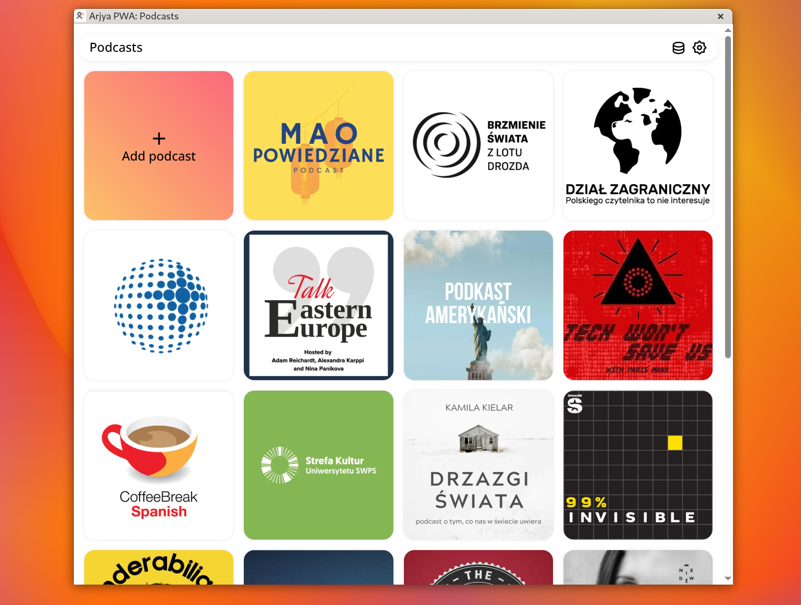
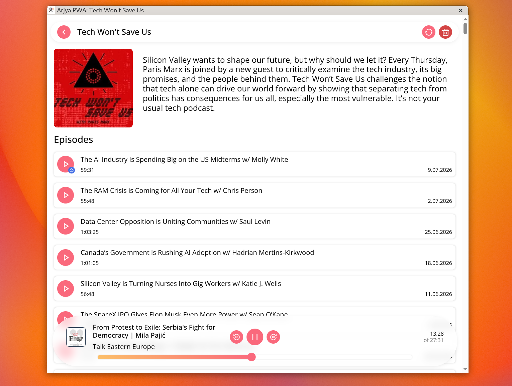
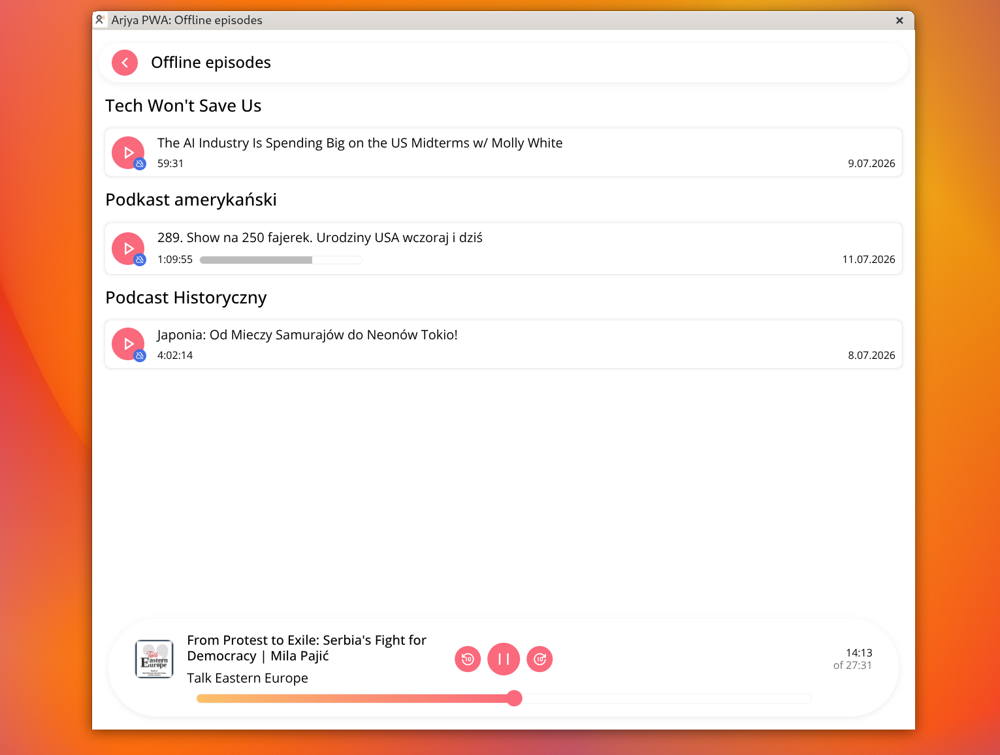

# arjya

Arjya is your personal stream of podcasts. Project is and always will be open sourced.

It allows you to listen to your favourite podcasts without proprietary streaming services from any device.

If you like my work, consider buying me a coffee!

[](https://buymeacoffee.com/mrowa96)

**CAUTION** Project is still in early stage of development so expect bugs, although main functionalities should be stable.

## Features

- **Allows you to stream episodes** from favourite podcasts
- **Supports search** via [Taddy](https://taddy.org/developers/podcast-api)
- **Works on any device** with recent browser
- For the most user friendly experience, it **supports PWA**
- **Allows you to be fully offline** (if you downloaded episodes beforehand)
- **Auto refreshes your podcasts** to show you recent episodes
- You own the data, **it keeps episodes in raw format**, so you can do with them whatever you want
- Doesn't require heavy database service, **utilizes SQLite**
- **Docker images provided**
- TBD: Supports light/dark mode
- TBD: Gives you ability to setup transcoding for lower data usage
- TBD: It's available in many langauges
- Tell me what you would like to see!

## Screenshots

### Desktop





### Mobile


## Run it on server

### Requirements

You will need `docker` and `docker compose` installed.

It was tested on `docker` 29.5.0 and `docker compose` 5.1.3.
Earlier versions probably will work well, but it's not guaranteed.

### How to?

1. Create main directory eg. `aryja` with `data`, `db` and `assets` directories inside of it
2. Create `compose.yml` in main directory with following content:

```yml
services:
  arjya-server:
    image: mrowa96/arjya-server:next
    envenvironment:
      - APP_HOSTNAME=0.0.0.0
      - APP_PUBLIC_URL=https://arjya-server-domain.public:3000
      - APP_PORT=3000
    ports:
      - '3000:3000'
    restart: on-failure:3
    volumes:
      - './db:/app/db'
      - './data:/app/data'
      - './assets:/app/assets'

  arjya-client-pwa:
    image: mrowa96/arjya-client-pwa:next
    ports:
      - '3001:80'
    restart: on-failure:3
    depends_on:
      - arjya-server
```

3. Run `docker compose up -d`

## Develop it locally

Project is divided into server and client(s) subprojects.
For more detailed information about those, check README file inside of them.

### Initial setup

You need to have right `node` version (check `.nvmrc` for minimal supported version).

1. Run `npm i` in root and subprojects dictionaries
2. In `server` directory copy `.env.example` to `.env` and replace values if needed.
3. In `server` directory run `npm run dev`
4. Separately, in `client-pwa` run `npm run generate:api-client`. You can terminate dev script in `server` now
5. From root, you can run `npm run dev` to start both `client-pwa` and `server`

Later, if you will be changed data returned from server, please remember to regenerate api client.
